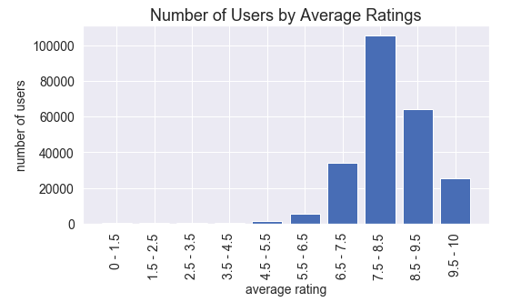

# Boardgame Recommendation System

## Summary
In this project, I collect the user ratings from [BoardgameGeek](https://boardgamegeek.com/)'s top 100 games, and train a colaborative-filtering recommendation system on it. The user enters a few games with their ratings, and the model returns a list of games the user would probably rate high. 

## Keywords
BeatifulSoup, Web Scraping, API requests, JSON, Collaborative-Filtering Recommender Systems, Memory-Based Recommenders, Model-Based Recommenders, Scikit-Surprise, 

## Links
I published a series of articles on the topic in Towards Data Science, see the links below: 
 
[Part 1 - KNN-Style Recommenders](https://towardsdatascience.com/how-to-build-a-memory-based-recommendation-system-using-python-surprise-55f3257b2cf4)
 
[Part 2 - My Additional Python Code](https://towardsdatascience.com/my-python-code-for-flexible-recommendations-b4d838e9e0e0)
 
[Part 3 - Matrix Factorisation Recommenders](https://towardsdatascience.com/how-to-build-a-model-based-recommendation-system-using-python-surprise-2df3b77ab3e5)

In addition to that, this project was the basis of my capstone project:
 
[Presentation](https://docs.google.com/presentation/d/1qKxO2TLHGmGMCSOYO37v1a-bLFWAbEmGfutsNbDwyew/edit#slide=id.p)

## Data
I obtained the data using a combination of web scraping with `BeautifulSoup` and `API` requests. For each game, I collected all the ratings where the user actually rated the game (as opposed to entries where they just mark the game as owned, or put in a text comment) as of March 31, 2020. Please note that it can take up to an hour to gather information of a game, depending on the number of ratings. 

The complete data contains 2.3m ratings from over 200k users. The average number of games rated by an individual user is about 10, meaning the database is about 90% sparse. 

## Metric
Using the Root Mean Squared Error, `rmse`, score to compare the different models. 

## Recommender Methodology
- `kNN` types: `kNNBaseline`, `kNNMeans`, `kNNZScore`
- matrix factorization: `SVD`, `SVDpp`
- combination of the two: `kNNBaseline`
- misc. models: `SlopeOne`, `CoClustering`

## Prediction Function
Using the `kNNMeans` model. Prediction model is a tradeoff between accuracy and speed, for the final showcase, I opted for this for two reasons: 
- it's from a memory-based model, meaning we can use the trained model's results and calculate the individual ratings, which is not a possibility with latent-factor models, where you would need to re-train the whole model for an additional user
- the `rmse` score of this model was relatively close to the best, so a great speed increase came at a cost at a minor decrease in reliability

## Files
The project contains the following files: 
- Jupyter notebooks: 
    - `01_dataprep.ipynb`: process of collecting and organising the data
    - `02_modelling_neighbours.ipynb`: the `kNN` models from `surprise`, training and cross-validating
    - `03_modelling_latent_factors.ipynb`: the `SVD` models from `surprise`, training and cross-validating
    - `04_results_data_and_predictions.ipynb`: all the code I needed for final presentation, including data visualisations and prediction functionality
- Individual Python scripts:
    - `bgg_data_func.py`: functions for data collecting, specifically tuned for boardgamegeek
    - `bgg_model_func.py`: functions for modelling
    - `game_name_converter.py`: converts raw boardgamegeek game id's to names
    - `recomm_func.py`: contains the main recommender class, `kNNMeansRecommender`
- Data:
    - `games_master_list.csv`: list of games in the project, along with boardgamegeek links and publication year
- Results (in `results` folder):
    - `top_10_similar_games_..._.csv`: for each game, saved the 10 closest games, according to three distance metric, `MSD`, `cosine`, and `pearson`
    - `kNN_..._scores.csv`: the `rmse` scores of `cross_validate` results of different model types
